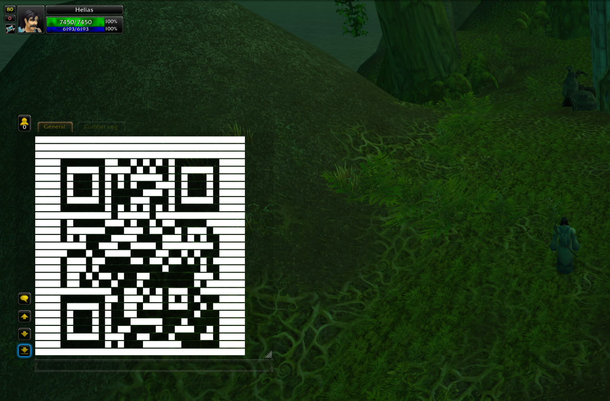
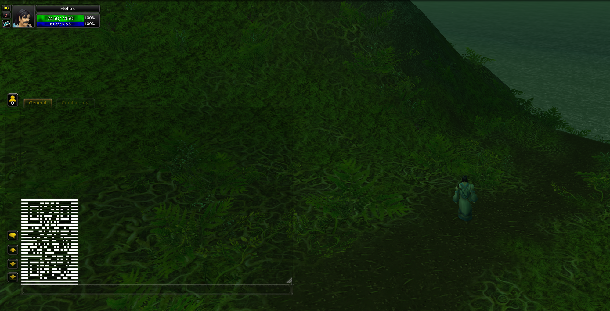

# mod-qr-code

Renders a scannable QR code to a player on a completely unmodified 3.3.5a client. No addon, no MPQ
patch, no client-side files of any kind.

```
.qr https://www.azerothcore.org
```



## How it works

The server cannot inject Lua or define client frames, but it can send text containing UI escape
sequences, and the client renders those. `ChatHandler::SendSysMessage` does not escape `|` in
server-originated strings, so the code is drawn as a grid of inline textures — one text line per QR
row, one `|T…|t` escape per run of same-coloured modules:

```
|TInterface/DialogFrame/UI-DialogBox-Background:14:28:0:0:100:100:45:55:45:55|t
```

**Modules cannot be tinted.** The 3.3.5a client accepts the escape's vertex-colour arguments and
then discards them, so asking for a black `WHITE8X8` just gets you a white square — verified in-game
against a raid-target icon, which renders in its own colours whatever vertex colour it is given. Each
colour therefore has to come from a texture that already is that colour: `Interface/Buttons/WHITE8X8`
for light modules, `Interface/DialogFrame/UI-DialogBox-Background` for dark ones.

The trailing numbers crop the texture to a sub-rect. That matters for the dark one, which is a
patterned stone panel: stretching the whole thing across a module shows the pattern, while a small
flat crop gives an even block, and evenness is what a decoder needs. Both textures and both crops are
config options, since which client textures are usable is not something the server can know.

The interesting part is the seam between rows. The chat font fixes the row spacing at roughly 16 px
and it does not shrink when the modules do, so anything smaller than that leaves a gap on every row.
Every escape in row *N* therefore carries a vertical offset of `-N * (LineAdvance - ModuleHeight)`,
lifting each row to close the gap without shrinking the layout height the text block reserves.

`LineAdvance` reads as a dial rather than a measurement: the client treats a positive offset as
**upward**, so a *lower* value packs the rows tighter, and 0 or negative is the normal setting. At
the default 7 px modules it lifts each row by 7 px, which lands them flush.

The offset moves only what is drawn, never the height each line reserves, so a grid of short modules
always leaves slack — and the smaller the modules, the more of it. `QRCode.AnchorBottom` decides
which end of the grid keeps its natural position: with it on, the last row sits on its own line and
the code lands just above the chat input box with the slack above it, where it reads as ordinary
empty chat. Turn it off and the code floats high in the frame with a conspicuous gap underneath.

That makes modules non-square on the quest backend. Decoding is unaffected: a uniform aspect scale is
an affine transform, which decoders resolve from the three finder patterns.

## Requirements

None beyond AzerothCore itself. The QR generator is vendored, so there is no new dependency, and the
module ships no SQL.

## Installation

```bash
cd modules
git clone https://github.com/azerothcore/mod-qr-code
cd ..
# reconfigure and rebuild the core as usual
```

Then edit `qrcode.conf` in your config directory (the build copies `conf/qrcode.conf.dist` there).

## Commands

| Command | Level | Description |
| --- | --- | --- |
| `.qr <text>` | Game Master | Renders `<text>` as a QR code via the configured backend. |
| `.qr gossip <text>` | Game Master | Opens a gossip menu whose "Show the QR code" option presents the code, whatever the backend. |
| `.qr grid [rows] [cols]` | Game Master | Checkerboard at the active geometry, no QR encoding. Defaults to 10×10. |
| `.qr probe <n>` | Game Master | Draws one line of `n` alternating modules ending in a three-module black sentinel. |

All of them need an in-game session; none work from the console. Both sides of `grid` are optional —
a single argument means a square of that size.

### Opening `.qr` to regular players

The world DB's `command` table overrides the compile-time level at load, so no rebuild is needed:

```sql
DELETE FROM `command` WHERE `name` = 'qr';
INSERT INTO `command` (`name`, `security`, `help`) VALUES
('qr', 0, 'Syntax: .qr $text\r\nRenders $text as a scannable QR code.');
```

Reload with `.reload command`. Leave `grid` and `probe` at Game Master — they are calibration tools,
and `probe` exists specifically to send lines large enough to find the client's limits.

The per-player cooldown and the payload echo's escape sanitisation are always compiled in, precisely
so that opening the command up is a database change rather than a rebuild.

## Configuration

Every option lives in `qrcode.conf` and is documented inline there. The ones worth knowing about
before first use:

| Option | Default | Purpose |
| --- | --- | --- |
| `QRCode.Backend` | 1 | 1 = system chat, 2 = quest details frame |
| `QRCode.MaxVersion` | 3 | Caps QR size. The quest frame cannot show past 3; chat past 4 is unwieldy |
| `QRCode.MaxPayloadBytes` | 32000 | Hard cap on the generated string |
| `QRCode.CooldownSeconds` | 5 | Per-player rate limit. Set to 0 while calibrating |
| `QRCode.DarkTexture` / `QRCode.LightTexture` | see conf | Texture per module colour — tinting is impossible |
| `QRCode.DarkTexCoords` / `QRCode.LightTexCoords` | see conf | Sub-rect crop, `texW:texH:left:right:top:bottom` |
| `QRCode.Chat.ModuleWidth` / `.ModuleHeight` | 7 | Module size — a version 1 code lands at ~203 px |
| `QRCode.Chat.LineAdvance` | 0 | Row-offset dial; lower packs rows tighter |
| `QRCode.AnchorBottom` | 1 | Sit the code at the bottom of its lines, not the top |

Every pixel value is a config option rather than a constant, so the whole module retunes with
`.reload config` — no restart, no rebuild.

### Backends

**Chat (1)** is the default and the safer of the two. The frame is resizable by the player, so there
is no width to fit inside; modules are square and the row offset collapses to zero, which means no
seams and no aspect distortion.

**Quest (2)** opens a quest details frame carrying the code as the quest description. The pane is
roughly 285 px wide and scrolls vertically, so modules have to be narrow and non-square. The frame is
server-pushed and its strings are inline, so nothing is written to the world DB or the client's quest
cache. Accept and Decline both close it cleanly.

**The gossip menu** is not a backend but the `.qr gossip` command: it opens a gossip window with a
"Show the QR code" option, and picking it prints the code in the chat frame, so the chat geometry
applies. The menu is only an entry point — the gossip window cannot carry the code itself, because
the client stops opening the window once its body text passes a limit somewhere between 3 and 4 KB
(measured in-game with `.qr grid`), and even a minimum-size code needs several times that. The quest
frame is no alternative hand-off target either: a full-size code in its description string crashes
the client (see Known limitations). The menu's body text travels as an `npc_text` id: the module
pushes the greeting as an unsolicited `SMSG_NPC_TEXT_UPDATE` under a reserved id (16777200 — just
below the core's default greeting id 16777215, and above the rest of the world DB, which stops at
921061), which the client caches on receipt. The window's gossip source is the player themself, so
no NPC has to exist or be targeted.

### Calibrating the geometry

The three pixel values interact, and "it scanned or it didn't" is not enough feedback to tune them
against. Work in this order:

1. Set `QRCode.CooldownSeconds = 0` and `.reload config`.
2. `.qr grid`. The squares must alternate clearly dark and light — if they all look the same, the
   two textures are not distinct enough and `QRCode.DarkTexture` needs changing. Preview any
   candidate in-game without touching the server:

   ```
   /run P=string.char(124) DEFAULT_CHAT_FRAME:AddMessage(P.."TInterface/Buttons/WHITE8X8:24:24"..P.."t")
   ```

3. Still on `.qr grid`, adjust `LineAdvance` and `.reload config` until the rows touch without
   overlapping. **Lower is tighter** — gaps left between rows means go down (negative is fine),
   rows overlapping or squashing means go up. Retune after any change to `ModuleHeight`.
4. `.qr probe 200`, then binary-search `n` upward until the three dark squares at the end of the
   line stop appearing. That is the client's real inbound line cap; set `QRCode.MaxPayloadBytes`
   comfortably below it.
5. `.qr https://example.com` and scan it with a phone.
6. Put `QRCode.CooldownSeconds` back.

If a code with clean geometry still refuses to scan, raise `QRCode.ErrorCorrection` from `L` to `M`
before changing anything else.

### Small size QR code recommended

Compact modules keep the code small and unobtrusive. The trade-off is blank space above the code: a
chat line always reserves the full font line height (~12 px at the default chat font) however short
the drawn modules are, so every row leaves `lineheight − ModuleHeight` px of unfillable slack, which
piles up as empty chat above the code.

```ini
QRCode.Chat.ModuleWidth = 4
QRCode.Chat.ModuleHeight = 4
QRCode.Chat.LineAdvance = -8
```



### Max size QR code recommended

Making each module as tall as the chat line itself eliminates the blank space entirely —
`LineAdvance = ModuleHeight` collapses the per-row offset to zero and every line is fully filled.
The code comes out ~300 px wide, so the chat frame must be wide enough: a wrapped row destroys the
grid. If thin seams appear between rows, the real line spacing is slightly larger than the module:
lower `LineAdvance` by 1; if rows overlap, raise it. `ModuleWidth` only affects width — the blank
space depends on `ModuleHeight` alone.

```ini
QRCode.Chat.ModuleWidth = 12
QRCode.Chat.ModuleHeight = 12
QRCode.Chat.LineAdvance = 12
```


## Known limitations

- **The gossip window cannot display a code directly.** The client silently refuses to open a gossip
  window whose body text passes a limit between 3 and 4 KB — a 7×7 `.qr grid` checkerboard opens,
  an 8×8 does not — and a minimum-size code needs several times that. This is why the gossip backend
  is a menu handing off to chat rather than a display surface of its own.
- **The quest backend is experimental and can crash the client.** A full-size code (~12 KB of
  escapes) in the quest description string crashed the 3.3.5 client outright, and the safe ceiling
  has not been measured. If you want to use it, calibrate upward from small `.qr grid` sizes with
  `QRCode.Backend = 2` and expect crashes along the way.
- **Chat timestamps break the chat backend.** A player with timestamps enabled gets a prefix on every
  line, which shifts each QR row sideways relative to the last. This is a client setting; the server
  cannot override it. Turn timestamps off before scanning.
- **A code is large.** A minimum-size symbol runs to roughly 15 KB of escape sequences and a version 3
  one to 27 KB, at about 1 KB per chat line. That is why the cooldown exists and why
  `MaxPayloadBytes` defaults high — a 12000 byte cap would reject every code. Longer texture paths
  cost real bytes here, so a shorter usable path is a genuine saving.
- **Capacity is small.** Geometry, not the encoder, is the binding constraint: version 3 at ECC L
  holds 53 bytes. Long URLs need shortening before they will fit.

## Tests

The encoder wrapper and the renderer are pure functions with no server, session or client dependency,
and `mod-qr-code.cmake` registers their tests with the core's `unit_tests` target:

```bash
cmake --build build --target unit_tests
./build/src/test/unit_tests --gtest_filter='Qr*'
```

This requires the module to be built statically (the default), since `unit_tests` links the `modules`
static library.

## Credits

QR symbol generation is [Nayuki's QR Code generator](https://www.nayuki.io/page/qr-code-generator-library),
C++ edition, vendored unmodified under `src/vendor/` and used under the MIT licence.

## Licence

AGPL-3.0, matching AzerothCore. See `LICENSE`.
