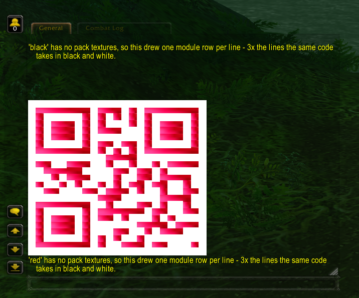
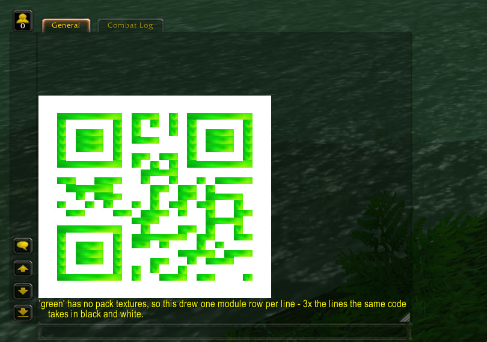
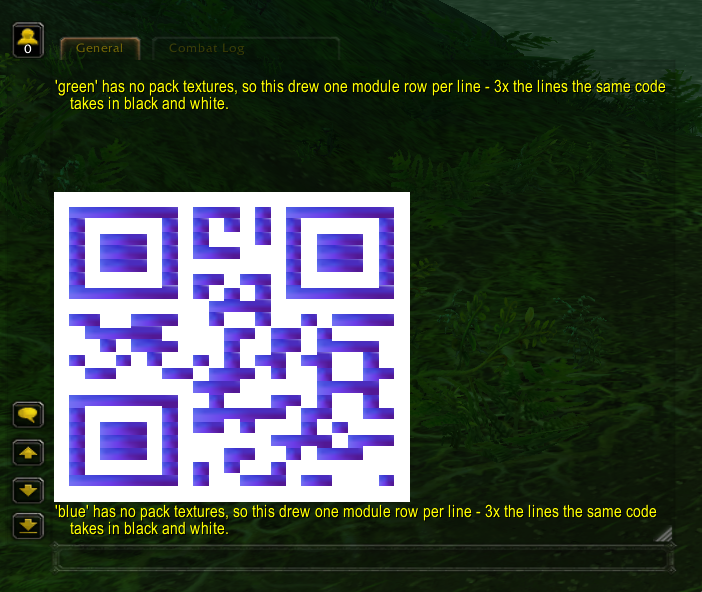

# mod-qr-code

Renders a scannable QR code to a player on a completely unmodified 3.3.5a client. No addon, no MPQ
patch, no client-side files of any kind.

```
.qr https://www.azerothcore.org
```


## How it works

The server cannot inject Lua or define client frames, but it can send text containing UI escape
sequences, and the client renders those. `ChatHandler::SendSysMessage` does not escape `|` in
server-originated strings, so the code is drawn as a grid of inline textures — one text line per QR
row, one `|T…|t` escape per run of same-coloured modules:

```
|TInterface/DialogFrame/UI-DialogBox-Background:14:28:0:0:100:100:45:55:45:55|t
```

**Modules cannot be tinted.** The 3.3.5a client accepts the escape's vertex-colour arguments and
then discards them, so asking for a black `WHITE8X8` just gets you a white square — verified in-game
against a raid-target icon, which renders in its own colours whatever vertex colour it is given. Each
colour therefore has to come from a texture that already is that colour: `Interface/Buttons/WHITE8X8`
for light modules, `Interface/DialogFrame/UI-DialogBox-Background` for dark ones.

The trailing numbers crop the texture to a sub-rect. That matters for the dark one, which is a
patterned stone panel: stretching the whole thing across a module shows the pattern, while a small
flat crop gives an even block, and evenness is what a decoder needs. Both textures and both crops are
config options, since which client textures are usable is not something the server can know.

The interesting part is the seam between rows. The chat font fixes the row spacing at roughly 16 px
and it does not shrink when the modules do, so anything smaller than that leaves a gap on every row.
Every escape in row *N* therefore carries a vertical offset of `-N * (LineAdvance - ModuleHeight)`,
lifting each row to close the gap without shrinking the layout height the text block reserves.

`LineAdvance` reads as a dial rather than a measurement: the client treats a positive offset as
**upward**, so a *lower* value packs the rows tighter, and 0 or negative is the normal setting. At
the default 7 px modules it lifts each row by 7 px, which lands them flush.

The offset moves only what is drawn, never the height each line reserves, so a grid of short modules
always leaves slack — and the smaller the modules, the more of it. `QRCode.AnchorBottom` decides
which end of the grid keeps its natural position: with it on, the last row sits on its own line and
the code lands just above the chat input box with the slack above it, where it reads as ordinary
empty chat. Turn it off and the code floats high in the frame with a conspicuous gap underneath.

That makes modules non-square on the quest backend. Decoding is unaffected: a uniform aspect scale is
an affine transform, which decoders resolve from the three finder patterns.

### Packing rows into one line

`QRCode.RowsPerLine` draws several module rows inside a single escape, cutting the chat lines a code
needs by that factor. Lines, not bytes, are what the chat frame runs out of, so this is the setting
that decides whether a code fits on screen at all.

| rows/line | modH | lines (v1) | on-screen | line grows? |
| --- | --- | --- | --- | --- |
| 1 | 7 | 23 | 368 px | no |
| 2 | 7 | 12 | 192 px | no |
| 3 | 7 | 8 | 168 px | **yes** |
| **3** | **5** | **8** | **128 px** | no ← shipped |

The ceiling is the chat font's fixed line advance, around 16 px. While `RowsPerLine * ModuleHeight`
stays under it the line keeps its normal height; past it the line grows to fit the taller escape and
hands the saving straight back. Two 7 px modules come to 14 px and fit, which is why 2 is free at the
shipped module size. Three only pays if you also drop `ModuleHeight` to about 5 and retune
`LineAdvance` — modules then become 7 wide by 5 tall, which decoders resolve as an affine transform
from the finder patterns, the same reason the quest backend gets away with non-square modules.

A packed escape needs a texture that already contains the whole column, because an escape names
exactly one texture; a dark module and a light one cannot be composited. Scanning the 3.3.5a
interface textures for an opaque rectangle with a hard horizontal black/white edge turns up 80
candidates and only two with flat bands in both directions. **Supply, not arithmetic, is what limits
this.** A candidate also has to be *neutral*, not merely the right brightness: luminance alone lets a
tan pixel through, and RGB 240,236,152 scores about 230 while rendering as a visibly yellow module.
Most of the client's artwork is warm, which rules it out. Two rows needs 4 crops and is comfortable,
three needs 8 and they exist but unevenly, four would need 16 and has no usable set.

Defaults for two rows crop the USK age-rating badge, `Interface/Glues/Login/Glues-GermanRating`,
which carries luminance 0 directly above 248 with 13 px of each. The three-row set scans at the shipped
4×5 modules but is the less comfortable of the two: its darks sit near 32 while `LDL` is 1 and `DLD`
is 26–37, and those two come from bands only 2–3 px tall. They hold up at 5 px and are the first
thing to suspect if a taller module stops scanning. All patterns in use
must agree on their black and their white, or the seam between lines reads as a module edge.

Packing buys far less in bytes than in lines, because a run has to agree on every row it spans and
merging weakens as fast as the line count falls. Measured on `https://www.azerothcore.org`:

|                | lines | escapes | bytes  |
|----------------|------:|--------:|-------:|
| one row a line |    27 |     349 | 20,559 |
| two rows       |    14 |     246 | 15,656 |

## Requirements

None beyond AzerothCore itself. The QR generator is vendored, so there is no new dependency, and the
only SQL shipped is one `command` table row, for `.account 2fa qrcode`.

## Installation

```bash
cd modules
git clone https://github.com/azerothcore/mod-qr-code
cd ..
# reconfigure and rebuild the core as usual
```

Then edit `qrcode.conf` in your config directory (the build copies `conf/qrcode.conf.dist` there).

## Commands

| Command | Level | Description |
| --- | --- | --- |
| `.qr <text>` | Game Master | Renders `<text>` as a QR code via the configured backend. |
| `.qr gossip <text>` | Game Master | Opens a gossip menu whose "Show the QR code" option presents the code, whatever the backend. |
| `.qr say <text>` | Game Master | Says the code aloud, so everyone in say range can scan it off their own screen. |
| `.qr color [name] [text]` | Game Master | Renders in one of the realm's configured colours. With no name, lists them. |
| `.qr swatch <texture> [texCoords]` | Game Master | Draws a candidate texture three ways so you can judge it as a module colour. |
| `.qr sweep <texture> [cells]` | Game Master | Samples a texture on a grid, drawing one flat bar per point with its texCoords beside it. |
| `.qr grid [rows] [cols]` | Game Master | Checkerboard at the active geometry, no QR encoding. Defaults to 10×10. |
| `.qr probe <n>` | Game Master | Draws one line of `n` alternating modules ending in a three-module black sentinel. |
| `.account 2fa qrcode [token]` | Player | Draws a new two-factor key as a code to scan; run again with a token to enable it. **Off by default** — see below. |

All of them need an in-game session; none work from the console. Both sides of `grid` are optional —
a single argument means a square of that size.

### Saying a code to the room

`.qr say <text>` sends the grid as the GM's own say chat instead of as a system message, one say per
line, so every client within `ListenRange.Say` (40 yards by default) draws the code in its own chat
frame. It is the way to put a scannable link in front of a crowd — an event sign-up, a Discord
invite — without every player having to run a command.

The rows always render at the chat geometry, whatever `QRCode.Backend` says, since chat is where they
land. Everything the chat backend needs still applies to every viewer individually: a chat frame tall
enough for the whole code, wide enough not to wrap a row, and timestamps off.

Each line arrives behind the client's `<name> says:` prefix. That prefix is the same width on every
row, so it shifts the grid sideways as a block rather than shearing it — which is exactly why
timestamps break the code and this does not. The say is sent as the universal language, because the
client garbles say text in a language the reading character does not know, and a garbled row is a
destroyed row.

Two things to be aware of before using it in a busy place. Viewers with chat bubbles enabled get one
bubble per line, each carrying a couple of kilobytes of escape sequences — the bubbles are not a
surface this module has calibrated, and they are the first thing to blame if a client behaves oddly.
And a code is tens of kilobytes sent to every player in range, not just to the caller, so leave the
command at Game Master and leave `QRCode.CooldownSeconds` alone.

### Colouring a code

`.qr color <name> <text>` draws the dark modules in a named colour. `.qr color` on its own lists
what is available.

`black`, `red`, `blue`, `green`, `yellow` and `purple` are compiled in and work with no configuration
at all, including on a `qrcode.conf` written before palettes existed. `qrcode.conf.dist` restates
their values so they are visible and easy to edit; deleting that block changes nothing.

All five colours are confirmed scanning in-game.





The gradient across each module there is the gem's own facets, and it is cosmetic: the crop is small
enough that every module stays inside one facet, so the code still thresholds. These also show the
size trade-off below — the same payload in black and white is a third as tall.

**Which side a colour goes on depends on how dark it measures, not on its name.** A decoder
thresholds brightness, so the two sides have to stay far apart in luminance. Ruby (~54 of 255),
sapphire, emerald and amethyst are all dark enough to be modules against white, so they replace the
dark side. Gold is around 190 and no crop of it separates from a white ground — so `yellow` sets
`LightTexture` instead, colouring the background and keeping black modules. Black on gold scans as
readily as red on white and still reads as a yellow code:


Purple shows the other half of the lesson. Its first crop came out pale lilac because the middle of
an amethyst is a highlight, not the stone — the saturated colour is off to one side, and `.qr sweep`
is what found it:


`LightTexture` is available to any colour you add, and is the answer whenever a swept bar looks too
pale to be a module:

```
QRCode.Palette.gold.DarkTexture = "Interface/Glues/Login/Glues-GermanRating"
QRCode.Palette.gold.DarkTexCoords = "128:128:1:51:89:100"
QRCode.Palette.gold.LightTexture = "Interface/Icons/INV_Misc_Gem_Topaz_02"
QRCode.Palette.gold.LightTexCoords = "64:64:30:34:38:42"
```

The dark crop there is the measured flat black, so only the ground is artwork — and an uneven
ground costs far less than an uneven module.

A coloured code is given a quiet zone of two modules whatever `QRCode.QuietZone` says, unless that
asks for more. This is measured, not reasoned — green would not scan at one and does at two. Colour
is the case that needs it: the crop comes from artwork rather than the measured black-and-white set
so its modules are less uniform, and the chat frame's background is dark, which leaves the quiet
zone as the only thing separating the symbol from a dark surround. It costs two lines.

`black` is the control. It reuses a crop the original texture search measured as flat, opaque and
luminance 0, so it draws the same colour an ordinary code does and is useless as a colour. It is
there to separate two failures: if `.qr color black` scans and `.qr color red` does not, the palette
machinery is fine and the red texture is the problem.

Only the dark side changes. Light is what a decoder thresholds against, so colouring it spends the
contrast the code is carrying.

Every field overrides on its own — set just the crop and the built-in texture is still used:

```
QRCode.Palette.red.DarkTexCoords = "100:100:40:60:40:60"
```

Extra colours go in under any name, and a `.reload config` picks them up. The names are read from
the option keys themselves, so there is no list to maintain and nothing to rebuild:

```
QRCode.Palette.crimson.DarkTexture = "Interface/Icons/INV_Misc_Gem_Ruby_02"
QRCode.Palette.crimson.DarkTexCoords = "64:64:24:40:24:40"
```

Two things decide whether a colour works, and neither is how it looks:

- **Luminance.** A decoder thresholds brightness, not hue. Pure red comes out around 54 of 255 and
  pure blue around 18, so both read as dark against white and scan. Pure green is about 182 — barely
  darker than the white background — and will not. A green that scans has to be dark enough to read
  as nearly black anyway.
- **Flatness and opacity.** A crop is stretched across a whole merged run of modules, so a gradient
  smears. Any alpha in the crop shows the chat frame's dark background through it, which destroys
  the light side of the code.

**A coloured code is usually three times as tall.** Packing needs a texture holding the colour and
the white as stacked bands in one crop, and the search that produced the black-and-white
`QRCode.Pack.*` defaults found two usable textures in the whole client — a coloured equivalent is
unlikely to exist. Without a complete `QRCode.Palette.<name>.Pack.*` set the colour falls back to one
module row per line, and the command says so after drawing. Keep coloured payloads short: a version 1
code is 23 lines, which a default chat frame shows; a 2FA payload at 35 is not worth attempting in
colour.

The coloured built-ins sample gem icons. `Interface/Icons` is the one directory this module has
already proven resolves — the pack defaults reach into it — and a gem icon is a large, saturated,
single-hue object filling most of its 64×64 frame, about the closest the client comes to shipping a
flat colour swatch.

**The crop is four texels, and the size is the point.** A gem icon is faceted, so a wide crop spans a
highlight and a shadow, and the client stretches that gradient across a whole merged run — the
modules come out as visible streaks and the code will not threshold. A window this small lands
inside a single facet and is flat whatever the artwork does around it.

**The coloured paths are candidates, not measurements, and one earlier set was already wrong.**
`Interface/COMMON/Indicator-*` does not exist in the client: the escapes drew nothing at all, and the
chat frame's dark background showing through the holes made the result look like an ordinary
black-and-white code that simply refused to scan. Which textures carry a flat, opaque region of a
given hue cannot be determined from the server side, so check before trusting one.

### Finding a texture

Start with a sweep — it samples the texture on a grid and draws one bar per point, with the
coordinates beside it. Each sample is a few texels, so every bar is a flat colour and its
coordinates are usable exactly as printed:

```
.qr sweep Interface/Icons/INV_Misc_Gem_Ruby_02
.qr sweep Interface/Icons/INV_Misc_Gem_Ruby_02 8    -- finer, 64 samples
```

**Every bar blank means the path is wrong, not the crop**, which is the fastest way to rule a texture
out. Otherwise pick the darkest, most saturated bar and confirm its coordinates:

```
.qr swatch Interface/Icons/INV_Misc_Gem_Ruby_02 100:100:35:39:60:64
```

That draws three bands — the crop solid, the crop against white, the crop against the configured
dark — and prints the config lines to paste. Solid shows whether the crop is flat. Band 2 is what the
decoder sees: if it does not read as a clean checker, the colour is too light to scan. Band 3 says
whether the colour is distinguishable from plain black; if it looks solid, the palette buys nothing
over the default.

### Two-factor setup by QR

A two-factor payload needs a version 4 symbol — 35 module rows. At the shipped `QRCode.RowsPerLine` 3, that is
12 chat lines and fits a default frame; with it off it is 35, which does not, and the player gets the
bottom two thirds of a code and no way to scan it. The command therefore ships enabled alongside
packing. **Turn it off if you set `RowsPerLine` to 1**, or confirm `.qr grid 35` fits your frame first —
see the chat-lines section below for what buys the room. When disabled the command refuses and points
the player at `.account 2fa setup`, which is the working fallback.

The core's `.account 2fa setup` prints a 32-character Base32 key and asks the player to type it into
an authenticator app before confirming with a token. `.account 2fa qrcode` is the same two steps with
the typing removed:

```
.account 2fa qrcode          -- draws the key as a code; scan it
.account 2fa qrcode 123456   -- the token your app now shows; this is what enables 2FA
```

**Nothing is written to the account until the token checks out.** A key stored on the draw alone
would lock the player out at the next login whenever the scan silently failed — recoverable only by a
GM running `.account set 2fa <account> off`. The key is printed as text under the code too, for
authenticator apps that are easier to type into than to point at a screen. `.account 2fa remove
<token>` is unaffected and still works.

Redrawing hands out the same key until it is confirmed, so a player who scanned the first code and
then asked for it again is not left holding an entry no token can complete. Pending keys live in
memory only and are dropped on restart; draw again after one.

**It replaces `.account 2fa setup`, it does not extend it.** The core keeps the key that command
offers in a `static` local to its own handler, so no module can render *that* key; the one here is a
second, independent secret, and its token only completes this command. Both write the same
`account.totp_secret` column and neither runs once it is set, so the two flows cannot collide — a
player takes one or the other. Admins who want only the QR flow visible can raise `account 2fa setup`
in the `command` table.

Once two-factor is enabled the command refuses, because re-showing a live secret would turn any
unattended session into a cloned authenticator.

The payload is an [otpauth URI](https://github.com/google/google-authenticator/wiki/Key-Uri-Format)
carrying only the label and the secret. AzerothCore's TOTP parameters — 6 digits, SHA1, 30 seconds —
are the format's defaults and are left out, as is the redundant `issuer` query parameter, purely to
keep the byte count down.

**It needs room.** Even a two-character account name with no issuer at all comes to 57 bytes, past
the 53 a version 3 code holds, and a realm name plus a long account name reaches version 5:

| Label | URI bytes | Version | Modules | Rendered | Row width at 7 px |
| --- | --- | --- | --- | --- | --- |
| `AzerothCore:HELIAS` | 73 | 4 | 33 | 36 KB | 245 px |
| `My Test Realm:AVERYLONGACCOUNT` | 89 | 5 | 37 | 46 KB | 273 px |

The row is wider than the symbol because of the quiet zone on each side.

The shipped `QRCode.MaxVersion = 5` and `QRCode.MaxPayloadBytes = 48000` cover both rows. Both are
ceilings rather than sizes — every payload still renders at the smallest version that holds it — so
if you have lowered either from an earlier release, raise them back or the command fails with a
config error instead of drawing anything.

**The binding constraint is chat lines, not pixels.** One QR row is one chat line, and the whole code
has to be on screen at once — a version 4 symbol is 33 modules plus the quiet zone on each side, so
35 lines at the shipped `QRCode.QuietZone = 1`, and anything past the top of the frame is simply not
there to scan. Shrinking `ModuleHeight` does not help: a chat line reserves the full font line height
whatever is drawn in it. What does help is a smaller chat font (right-click the chat tab → Font Size)
and a taller chat frame. `.qr grid 35` tells you in one command whether 35 lines fit.

The quiet zone is the reason the default is 1 rather than the 4 the spec asks for: each module of
border is two more lines to find room for. Raise it if a code will not scan.

Note that `LineAdvance` is tuned against the font's line spacing, so changing the font size means
retuning it: the flush value is `2 × ModuleHeight − line height`, and `.qr grid` shows whether you
got it.

Also worth having is a chat frame wide enough for the row: a wrapped row destroys the grid.
`QRCode.TwoFA.Issuer` shortens the label if the realm name is long, and every byte saved there is
worth having, since crossing a version boundary costs four more rows. The quest backend is no help
here either: at `QuietZone = 1` a version 4 code is 245 px wide and does fit the 285 px pane, but the
pane is only about 300 px tall against the ~490 px those 35 lines need, and it is the backend that
has crashed the client at full size.

The secret is drawn into the chat frame in the clear, exactly as `.account 2fa setup` prints it in the
clear. Anyone watching the screen or the stream can enrol the same authenticator, so it is worth
telling players to run this alone.

### Opening `.qr` to regular players

The world DB's `command` table overrides the compile-time level at load, so no rebuild is needed:

```sql
DELETE FROM `command` WHERE `name` = 'qr';
INSERT INTO `command` (`name`, `security`, `help`) VALUES
('qr', 0, 'Syntax: .qr $text\r\nRenders $text as a scannable QR code.');
```

Reload with `.reload command`. Leave `grid`, `probe` and `swatch` at Game Master — they are
calibration tools, and `probe` exists specifically to send lines large enough to find the client's
limits. Leave `say` there too: it is the one command that ships its output to other people's clients.

The per-player cooldown and the payload echo's escape sanitisation are always compiled in, precisely
so that opening the command up is a database change rather than a rebuild.

## Configuration

Every option lives in `qrcode.conf` and is documented inline there. The ones worth knowing about
before first use:

| Option | Default | Purpose |
| --- | --- | --- |
| `QRCode.Backend` | 1 | 1 = system chat, 2 = quest details frame |
| `QRCode.MaxVersion` | 5 | Caps QR size. The quest frame cannot show past 3; chat past 5 is unwieldy |
| `QRCode.MaxPayloadBytes` | 48000 | Hard cap on the generated string |
| `QRCode.CooldownSeconds` | 5 | Per-player rate limit. Set to 0 while calibrating |
| `QRCode.QuietZone` | 1 | Light border in modules, 1-4. Each one costs two chat lines; the spec asks for 4 |
| `QRCode.RowsPerLine` | 3 | Module rows per chat line, 1-4. Cuts the height a code needs |
| `QRCode.TwoFA.Enable` | 1 | Offers `.account 2fa qrcode`. Turn off if you set `RowsPerLine` to 1 |
| `QRCode.TwoFA.Issuer` | "" | Label shown by the authenticator app; empty means the realm name |
| `QRCode.DarkTexture` / `QRCode.LightTexture` | see conf | Texture per module colour — tinting is impossible |
| `QRCode.Palette.<name>.DarkTexture` | see conf | Overrides or adds a `.qr color` colour. The five built-ins are unverified candidates |
| `QRCode.DarkTexCoords` / `QRCode.LightTexCoords` | see conf | Sub-rect crop, `texW:texH:left:right:top:bottom` |
| `QRCode.Chat.ModuleWidth` / `.ModuleHeight` | 4 / 5 | Module size. Paired with `RowsPerLine` — see below |
| `QRCode.Chat.LineAdvance` | -4 | Row-offset dial; lower packs lines tighter |
| `QRCode.AnchorBottom` | 1 | Sit the code at the bottom of its lines, not the top |

Every pixel value is a config option rather than a constant, so the whole module retunes with
`.reload config` — no restart, no rebuild.

**Turning the code is not a way out of the height problem**, tempting as it looks when the frame is
wider than it is tall. A QR symbol is square, so a quarter turn gives back a square of the same side:
the same 35 rows, the same 35 chat lines. Off-axis angles are worse than useless — a 45° turn needs a
bounding box √2 larger, taking 35 rows to about 50, and the `|T` escape places an axis-aligned quad
anyway, so the turned modules would have to be rasterised back onto square blocks, staircase edges
being exactly what a scanner fails on.

### Backends

**Chat (1)** is the default and the safer of the two. The frame is resizable by the player, so there
is no width to fit inside; modules are square and the row offset collapses to zero, which means no
seams and no aspect distortion.

**Quest (2)** opens a quest details frame carrying the code as the quest description. The pane is
roughly 285 px wide and scrolls vertically, so modules have to be narrow and non-square. The frame is
server-pushed and its strings are inline, so nothing is written to the world DB or the client's quest
cache. Accept and Decline both close it cleanly.

**The gossip menu** is not a backend but the `.qr gossip` command: it opens a gossip window with a
"Show the QR code" option, and picking it prints the code in the chat frame, so the chat geometry
applies. The menu is only an entry point — the gossip window cannot carry the code itself, because
the client stops opening the window once its body text passes a limit somewhere between 3 and 4 KB
(measured in-game with `.qr grid`), and even a minimum-size code needs several times that. The quest
frame is no alternative hand-off target either: a full-size code in its description string crashes
the client (see Known limitations). The menu's body text travels as an `npc_text` id: the module
pushes the greeting as an unsolicited `SMSG_NPC_TEXT_UPDATE` under a reserved id (16777200 — just
below the core's default greeting id 16777215, and above the rest of the world DB, which stops at
921061), which the client caches on receipt. The window's gossip source is the player themself, so
no NPC has to exist or be targeted.

### Calibrating the geometry

The three pixel values interact, and "it scanned or it didn't" is not enough feedback to tune them
against. Work in this order:

1. Set `QRCode.CooldownSeconds = 0` and `.reload config`.
2. `.qr grid`. The squares must alternate clearly dark and light — if they all look the same, the
   two textures are not distinct enough and `QRCode.DarkTexture` needs changing. Preview any
   candidate in-game without touching the server:

   ```
   /run P=string.char(124) DEFAULT_CHAT_FRAME:AddMessage(P.."TInterface/Buttons/WHITE8X8:24:24"..P.."t")
   ```

3. Still on `.qr grid`, adjust `LineAdvance` and `.reload config` until the rows touch without
   overlapping. **Lower is tighter** — gaps left between rows means go down (negative is fine),
   rows overlapping or squashing means go up. Retune after any change to `ModuleHeight`.
4. `.qr probe 200`, then binary-search `n` upward until the three dark squares at the end of the
   line stop appearing. That is the client's real inbound line cap; set `QRCode.MaxPayloadBytes`
   comfortably below it.
5. `.qr https://example.com` and scan it with a phone.
6. Put `QRCode.CooldownSeconds` back.

If a code with clean geometry still refuses to scan, raise `QRCode.ErrorCorrection` from `L` to `M`
before changing anything else.

### Small size QR code recommended

Compact modules keep the code small and unobtrusive. The trade-off is blank space above the code: a
chat line always reserves the full font line height (~12 px at the default chat font) however short
the drawn modules are, so every row leaves `lineheight − ModuleHeight` px of unfillable slack, which
piles up as empty chat above the code.

```ini
QRCode.Chat.ModuleWidth = 4
QRCode.Chat.ModuleHeight = 4
QRCode.Chat.LineAdvance = -8
```


### Max size QR code recommended

Making each module as tall as the chat line itself eliminates the blank space entirely —
`LineAdvance = ModuleHeight` collapses the per-row offset to zero and every line is fully filled.
The code comes out ~300 px wide, so the chat frame must be wide enough: a wrapped row destroys the
grid. If thin seams appear between rows, the real line spacing is slightly larger than the module:
lower `LineAdvance` by 1; if rows overlap, raise it. `ModuleWidth` only affects width — the blank
space depends on `ModuleHeight` alone.

```ini
QRCode.Chat.ModuleWidth = 12
QRCode.Chat.ModuleHeight = 12
QRCode.Chat.LineAdvance = 12
```


## Known limitations

- **Chat is the only surface known to hold a code, and not because its buffer is bigger.** Every
  other frame takes the whole grid as one string, and no string surface measured so far holds more
  than about 8 KB, against 31 KB for the cheapest full code. Chat wins by sending 35 separate ~1 KB
  messages. Ceilings below were measured by rendering checkerboards of known size into each surface
  and finding where the frame goes blank:

  | Surface | Ceiling | Fits a code? | Evidence |
  | --- | --- | --- | --- |
  | Chat | ~1 KB per line, 35 lines | yes | the only one that splits the grid across many strings |
  | Page text | 32,766 B (one packet per page) | unmeasured | `SMSG_PAGE_TEXT_QUERY_RESPONSE` carries one page alone |
  | GM ticket response | 3,999 B | no | `GmTicket::SendResponse` sends 4 chunks of 3,999 but the client renders only the first — byte 3,999 shows up on screen as raw `\|T` text |
  | Mail body | 7.3-8.3 KB | no | 7,258 B renders, 8,322 B is blank — matches the `max 8000` note in `MailHandler.cpp` |
  | Quest text | 2.9-5.9 KB | no | 7×7 and 10×5 render, 10×10 is blank |
  | Gossip body | 3.4-4.4 KB | no | 7×7 opens the window, 8×8 does not |
  | Calendar event | 255 B | no | `varchar(255)` column, and `CalendarHandler.cpp:248` rejects longer |

  Oversized text fails silently and blank, never with an error. Mail has a second cap on top: the
  server drops any mail that would push `SMSG_MAIL_LIST_RESULT` past `MAX_NETCLIENT_PACKET_SIZE`
  (32,766), which the client reports as "your inbox is full" — and because every mail in the inbox
  shares that one packet, a large body can push the others out of the list.

  For scale: the smallest QR that exists — version 1, 21 modules, at three rows per line with the
  quiet zone dropped entirely — is 8,322 bytes, which mail renders as blank. Nothing is left to
  trim, so no surface but chat can hold a code. That is why the gossip
  backend is a menu handing off to chat rather than a display surface of its own, and why no mail,
  quest or ticket backend exists.
- **The quest backend cannot show a full-size code, and can crash the client trying.** A full-size
  code in the quest description crashed the 3.3.5 client outright, and the ceiling above puts a real
  code an order of magnitude past what quest text holds anyway. It is kept for small payloads and
  calibration only: start from small `.qr grid` sizes with `QRCode.Backend = 2`.
- **Chat timestamps break the chat backend.** A player with timestamps enabled gets a prefix on every
  line, which shifts each QR row sideways relative to the last. This is a client setting; the server
  cannot override it. Turn timestamps off before scanning.
- **A code is large.** A minimum-size symbol runs to roughly 15 KB of escape sequences, a version 3
  one to 27 KB and a version 4 one to 37 KB, at about 1 KB per chat line. That is why the cooldown
  exists and why `MaxPayloadBytes` defaults high — a 12000 byte cap would reject every code.
  Texture paths are charged on every run, so they are worth real bytes: dropping
  `QRCode.DarkTexCoords` and using the shorter `Interface/Tooltips/UI-Tooltip-Background` takes the
  same version 4 code from 38,829 to 31,104 bytes, at the cost of a greyer dark module.
  `QRCode.RowsPerLine` cuts the line count, but it is not a way under a byte ceiling: measured
  against these cheapest paths it saves 16% on a version 1 code and only 5% on a version 4 one,
  because a packed style has to carry a longer path and a crop on three of its four states.
- **Capacity is small.** Geometry, not the encoder, is the binding constraint: version 5 at ECC L
  holds 106 bytes, version 3 only 53. Long URLs need shortening before they will fit.

## Tests

The encoder wrapper, the renderer and the otpauth URI builder are pure functions with no server,
session or client dependency, and `mod-qr-code.cmake` registers their tests with the core's
`unit_tests` target:

```bash
cmake --build build --target unit_tests
./build/src/test/unit_tests --gtest_filter='Qr*'
```

This requires the module to be built statically (the default), since `unit_tests` links the `modules`
static library.

## Credits

QR symbol generation is [Nayuki's QR Code generator](https://www.nayuki.io/page/qr-code-generator-library),
C++ edition, vendored unmodified under `src/vendor/` and used under the MIT licence.

## Licence

AGPL-3.0, matching AzerothCore. See `LICENSE`.
