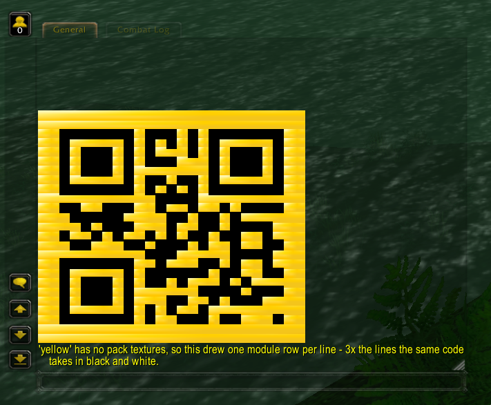
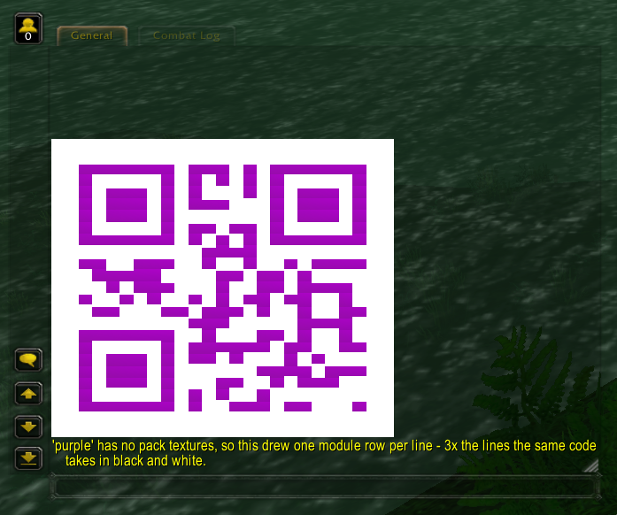

# Colouring a code

The [README](../README.md) has the gallery and the commands. This is how the colours are chosen, why
some go on one side of the code and some on the other, and how to add your own.

`black`, `red`, `blue`, `green`, `yellow` and `purple` are compiled in and work with no configuration
at all, including on a `qrcode.conf` written before palettes existed. `qrcode.conf.dist` restates
their values so they are visible and easy to edit; deleting that block changes nothing.

All five colours are confirmed scanning in-game. The gradient across each module of a gem colour is
the stone's own facets, and it is cosmetic: the crop is small enough that every module stays inside
one facet, so the code still thresholds.

**Which side a colour goes on depends on how dark it measures, not on its name.** A decoder
thresholds brightness, so the two sides have to stay far apart in luminance. Ruby (~54 of 255),
sapphire, emerald and amethyst are all dark enough to be modules against white, so they replace the
dark side. Gold is around 190 and no crop of it separates from a white ground — so `yellow` sets
`LightTexture` instead, colouring the background and keeping black modules. Black on gold scans as
readily as red on white and still reads as a yellow code:



Purple shows the other half of the lesson. Its first crop came out pale lilac because the middle of
an amethyst is a highlight, not the stone — the saturated colour is off to one side, and `.qr sweep`
is what found it:



`LightTexture` is available to any colour you add, and is the answer whenever a swept bar looks too
pale to be a module:

```
QRCode.Palette.gold.DarkTexture = "Interface/Glues/Login/Glues-GermanRating"
QRCode.Palette.gold.DarkTexCoords = "128:128:1:51:89:100"
QRCode.Palette.gold.LightTexture = "Interface/Icons/INV_Misc_Gem_Topaz_02"
QRCode.Palette.gold.LightTexCoords = "64:64:30:34:38:42"
```

The dark crop there is the measured flat black, so only the ground is artwork — and an uneven
ground costs far less than an uneven module.

A coloured code is given a quiet zone of two modules whatever `QRCode.QuietZone` says, unless that
asks for more. This is measured, not reasoned — green would not scan at one and does at two. Colour
is the case that needs it: the crop comes from artwork rather than the measured black-and-white set
so its modules are less uniform, and the chat frame's background is dark, which leaves the quiet
zone as the only thing separating the symbol from a dark surround. It costs two lines.

`black` is the control. It reuses a crop the original texture search measured as flat, opaque and
luminance 0, so it draws the same colour an ordinary code does and is useless as a colour. It is
there to separate two failures: if `.qr color black` scans and `.qr color red` does not, the palette
machinery is fine and the red texture is the problem.

Every field overrides on its own — set just the crop and the built-in texture is still used:

```
QRCode.Palette.red.DarkTexCoords = "100:100:40:60:40:60"
```

Extra colours go in under any name, and a `.reload config` picks them up. The names are read from
the option keys themselves, so there is no list to maintain and nothing to rebuild:

```
QRCode.Palette.crimson.DarkTexture = "Interface/Icons/INV_Misc_Gem_Ruby_02"
QRCode.Palette.crimson.DarkTexCoords = "64:64:30:34:38:42"
```

Two things decide whether a colour works, and neither is how it looks:

- **Luminance.** A decoder thresholds brightness, not hue. Pure red comes out around 54 of 255 and
  pure blue around 18, so both read as dark against white and scan. Pure green is about 182 — barely
  darker than the white background — and will not. A green that scans has to be dark enough to read
  as nearly black anyway.
- **Flatness and opacity.** A crop is stretched across a whole merged run of modules, so a gradient
  smears. Any alpha in the crop shows the chat frame's dark background through it, which destroys
  the light side of the code.

**A coloured code is usually three times as tall.** Packing needs a texture holding the colour and
the white as stacked bands in one crop, and the search that produced the black-and-white
`QRCode.Pack.*` defaults found two usable textures in the whole client — a coloured equivalent is
unlikely to exist. Without a complete `QRCode.Palette.<name>.Pack.*` set the colour falls back to one
module row per line, and the command says so after drawing. Keep coloured payloads short: a version 1
code is 23 lines, which a default chat frame shows; a 2FA payload at 35 is not worth attempting in
colour.

The coloured built-ins sample gem icons. `Interface/Icons` is the one directory this module has
already proven resolves — the pack defaults reach into it — and a gem icon is a large, saturated,
single-hue object filling most of its 64×64 frame, about the closest the client comes to shipping a
flat colour swatch.

**The crop is four texels, and the size is the point.** A gem icon is faceted, so a wide crop spans a
highlight and a shadow, and the client stretches that gradient across a whole merged run — the
modules come out as visible streaks and the code will not threshold. A window this small lands
inside a single facet and is flat whatever the artwork does around it.

**The coloured paths are candidates, not measurements, and one earlier set was already wrong.**
`Interface/COMMON/Indicator-*` does not exist in the client: the escapes drew nothing at all, and the
chat frame's dark background showing through the holes made the result look like an ordinary
black-and-white code that simply refused to scan. Which textures carry a flat, opaque region of a
given hue cannot be determined from the server side, so check before trusting one.

## Finding a texture

Start with a sweep — it samples the texture on a grid and draws one bar per point, with the
coordinates beside it. Each sample is a few texels, so every bar is a flat colour and its
coordinates are usable exactly as printed:

```
.qr sweep Interface/Icons/INV_Misc_Gem_Ruby_02
.qr sweep Interface/Icons/INV_Misc_Gem_Ruby_02 8    -- finer, 64 samples
```

**Every bar blank means the path is wrong, not the crop**, which is the fastest way to rule a texture
out. Otherwise pick the darkest, most saturated bar and confirm its coordinates:

```
.qr swatch Interface/Icons/INV_Misc_Gem_Ruby_02 100:100:35:39:60:64
```

That draws three bands — the crop solid, the crop against white, the crop against the configured
dark — and prints the config lines to paste. Solid shows whether the crop is flat. Band 2 is what the
decoder sees: if it does not read as a clean checker, the colour is too light to scan. Band 3 says
whether the colour is distinguishable from plain black; if it looks solid, the palette buys nothing
over the default.
